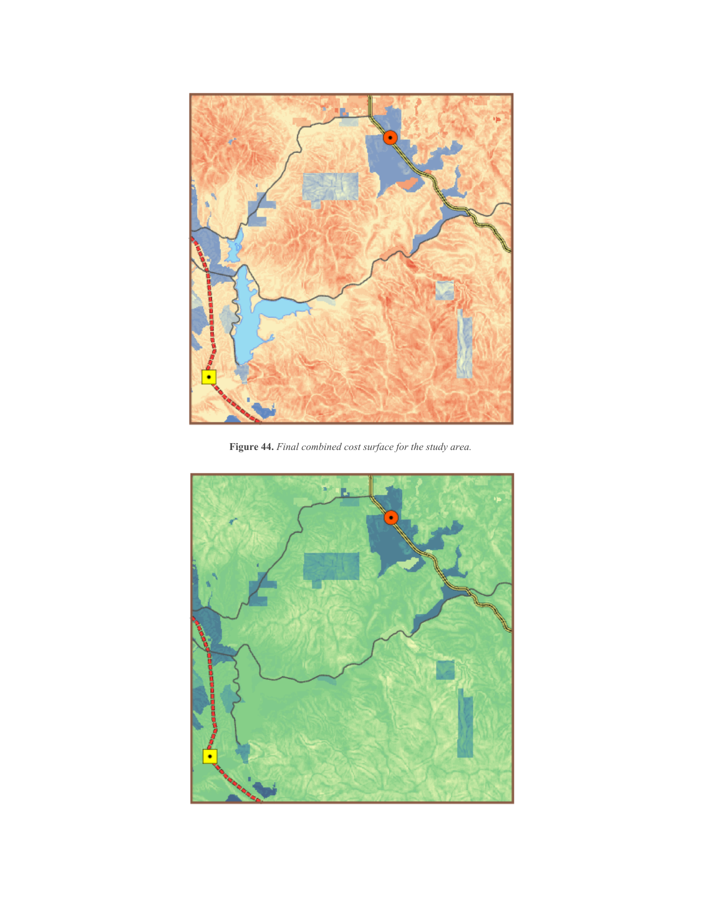
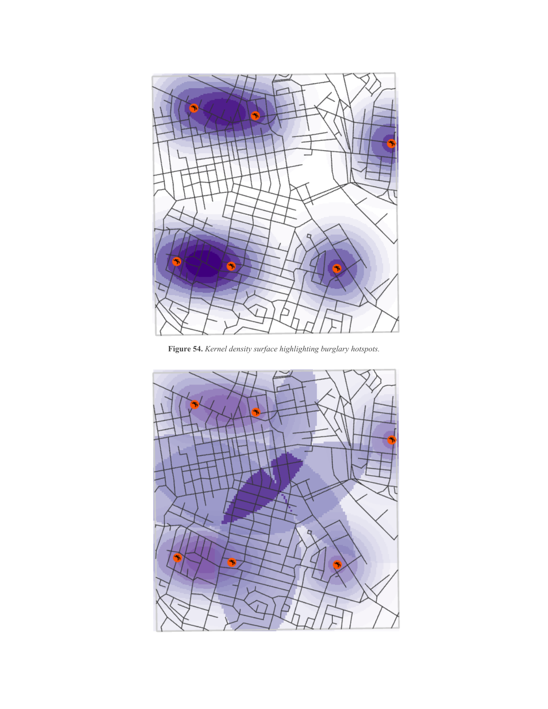

# Mapping Distance and Density — ArcGIS Spatial Analyst

**Author:** Qandeel Fatima  
**Program:** BE 22 GIE — Geo-Informatics Engineering  
**Registration No:** 405125  
**Lab No:** Lab 3 (Module 5)  
**Software:** ArcMap / ArcGIS Spatial Analyst  

---

## Overview

This report documents a practical lab exercise on **distance and density analysis** using the ArcGIS Spatial Analyst extension. The exercise covers four tasks that progress from simple straight-line distance surfaces through cost-weighted routing to kernel density mapping, all assembled as repeatable workflows in **ModelBuilder**.

---

## Objectives

By the end of this exercise a student should be able to:

- Create **straight-line distance**, direction, and allocation surfaces
- Create **cost-weighted distance**, direction, and allocation surfaces
- Perform a **least-cost path analysis** between a source and a destination
- Create **density surfaces** using the simple and kernel methods
- Estimate density using the **attribute values** of point features

---

## Software & Data

| Item | Detail |
|---|---|
| Software | ArcMap 10.x with Spatial Analyst extension |
| Map documents | `Distance.mxd`, `Density.mxd` |
| Workflow tool | ModelBuilder (custom `DistanceTools.tbx`) |
| Coordinate system | Study-area projection (supplied datasets) |

---

## Tasks & Methodology

### Task 1 — Straight-Line (Euclidean) Distance

**Scenario:** Air-ambulance dispatch — how far is every location from its nearest hospital?

The **Euclidean Distance** tool produces a raster where each cell stores its shortest straight-line distance to the nearest source (hospital). The **Euclidean Allocation** tool assigns each cell to its nearest hospital, partitioning the study area into hospital service zones. Distance values were converted from map units to **miles** using the Divide tool, then grouped into readable classes with **Reclassify**.

**Outputs:**
- Straight-line distance surface (greyscale, miles to nearest hospital)
- Allocation surface (hospital service areas / Thiessen zones)
- Distance-direction and back-direction surfaces

---

### Task 2 — Cost-Weighted Distance & Least-Cost Path

**Scenario:** Routing a new power line from Otay Valley Power Plant to Jamul Substation.

Unlike straight-line distance, a **cost-weighted surface** accumulates travel cost outward from the source. Two cost factors were combined:

1. **Terrain slope** — derived from the DEM and reclassified so steeper ground = higher cost
2. **Land-use type** — each land-use category ranked by relative difficulty/restriction

The two ranked rasters were summed with the **Plus** tool into a single `COST` surface. The **Cost Distance** tool then produced cost-distance and cost-direction surfaces from the power plant, and the **Cost Path** tool traced the least-cost route back to the substation.

#### Final Combined Cost Surface



> **Figure 44.** The combined cost surface (slope cost + land-use cost) draped over the terrain. Warm tones indicate high-cost areas (steep slopes or restricted land); cool tones indicate low-cost corridors preferred by the routing algorithm.

**Outputs:**
- Reclassified slope-cost raster (`RecPowerSlope`)
- Reclassified land-use cost raster (`RecLandUse`)
- Combined `COST` surface
- Cost-distance and cost-direction surfaces from the power plant
- **Least-cost path** — the cheapest power-line route from plant to substation

---

### Task 3 — Density Surfaces (Simple & Kernel Methods)

**Scenario:** Mapping the spatial concentration of burglary incidents across a street network.

Both density methods use a **circular search neighbourhood**:

| Method | How it works |
|---|---|
| **Simple** | Counts features within the neighbourhood, divides by neighbourhood area |
| **Kernel** | Fits a smooth surface around each point (1 at the point, 0 at boundary); sums overlapping kernels |

The kernel method produces smoother, more interpretable hotspot surfaces. Darker areas in the output mark clusters of high incident concentration.

#### Kernel Density — Burglary Hotspots



> **Figure 54.** Kernel density surface highlighting burglary hotspots across the street network. Deep purple clusters identify areas of highest incident concentration; light purple/white areas have sparse activity. The street network is overlaid for spatial context.

---

### Task 4 — Attribute-Weighted Density

**Scenario:** Refining the density surface by weighting each point by its `SCORE` attribute.

Instead of counting every incident equally, the kernel function ran from the **attribute value** at each point down to zero at the neighbourhood boundary. Cell values become the sum of overlapping weighted kernels. The `SCORE`-weighted surface distinguishes not only *where* incidents occur but *how significant* each one is, producing a more realistic picture of spatial intensity.

**Outputs:**
- Attribute-weighted kernel density surface (burglary SCORE)
- Attribute-weighted kernel density surface (grand theft SCORE)

---

## Key Findings

| Task | Method | Key Result |
|---|---|---|
| 1 — Euclidean Distance | Straight-line | Study area partitioned into hospital service zones; distance converted to miles and classified |
| 2 — Cost-Weighted Distance | Cost surface (slope + land use) | Least-cost power-line route identified through low-slope, low-restriction corridors |
| 3 — Kernel Density | Kernel smoothing | Clear burglary hotspots revealed that were invisible in raw point data |
| 4 — Attribute Density | Weighted kernel | SCORE-weighted surface reflects incident severity, not just frequency |

---

## Discussion

The exercise demonstrated the practical difference between the two distance families. **Straight-line distance** is simple and is used directly where travel is unobstructed (air ambulance). **Cost-weighted distance** is more realistic for overland movement but its cell values are accumulated costs, not distances, so it is used indirectly as the input to a least-cost path rather than read as a map of distance.

The density tasks showed how point observations can be turned into continuous surfaces that expose spatial patterns. The **kernel method** produced smoother, more readable hotspots than the simple method, and **attribute weighting** produced a surface that reflects the importance of each observation rather than treating all points equally.

ModelBuilder proved valuable for assembling multi-step workflows into reproducible models that can be re-run with updated inputs without repeating manual steps.

---

## Repository Structure

```
.
├── dis-den.pdf      # Full lab report (PDF)
├── README.md        # This file
└── images/
    ├── 01_euclidean_distance_surface.png
    ├── 02_distance_direction_surface.png
    ├── 03_cost_surface_final.png
    ├── 04_least_cost_path.png
    ├── 05_kernel_density_hotspots.png
    └── 06_attribute_weighted_density.png
```

---

## References

- ESRI (2024). *ArcGIS Desktop: Distance and Density Analysis*. Esri Documentation.  
- Module 5 Lab Materials — Spatial Analyst Distance and Density Functions, BE GIE Programme.
